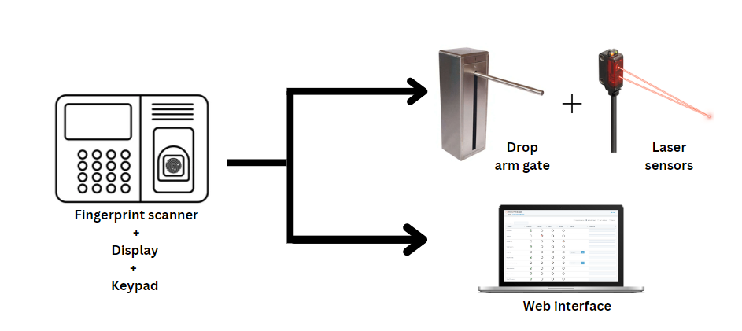
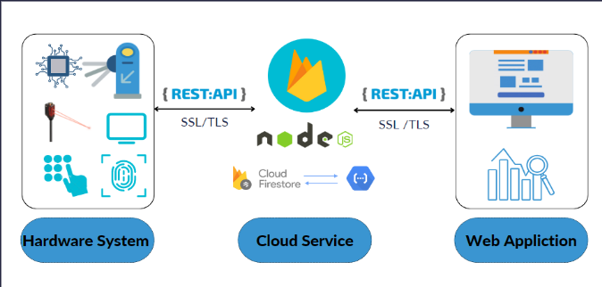
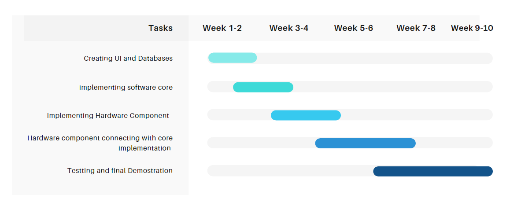

# e18-3yp-Smart-Gate-Keeping-and-Authentication-System

## Introduction

Based on the proper management and security purposes, authorities of various institutions use different methods like verifying the identity of a person and keeping
records. The system they are using to achieve this may be different. But, there are some instances where we wants to verify the identity of a user very accurately.
One of the examples is examinations. Examinations are conducting in various educational institutions such as schools, universities etc. But we identified some problems
in the existing systems.
It costs time for manually check and verify users accurately.
Violating rules by unauthorized access of people can be preventable.
Keeping records of attendances and store data can be done more efficiently.

So, the motivation of our project is to design a system that can verify the identity of a person/user who registered for the examination/event, keeping a record of their
presence/attendance and also providing administration of relevant institution with manageable records. The system could be used for any institution where they need to
have authorized people to enter/access premises.

We propose to design a gatekeeping system that gets the attendance of the person using a fingerprint scanner(including a keypad and a display screen) and a drop arm gate 
that opens for a correctly verified fingerprint. The system is connected to a management system of the institution. The administration of the institution can view and 
handle data there. The registered users can use the fingerprint scanner. In a situation where the fingerprint scanner cannot detect the fingerprint correctly, the user 
can use the keypad for entering permissions. The registration number will be the key to marking attendance. After scanning the fingerprint or giving the key, the display 
screen will display the relevant details of the user. Then, the gate will open for some time range and the user can pass through the gate. Before and after passing the 
gate, the laser sensors will detect whether the user passed the gate or not. So, with this process, the administration of the institution can see the record of the 
entrance of the user from the website. So, the system will provide a solution for the above problem by reducing the time spent on the process and by accurately verifying 
whether a person is registered or not.

## Solution Architecture

A fingerprint module is a device that captures and processes fingerprint data to verify an individual's identity (User Authentication). R037 Fingerprint module captures an image of fingerprint data and sends that image to our hardware platform, the NODEMCU microcontroller to either verify or store data inside our external storage (SD card module) other than in in-built flash memory. The data on the position of the verified person on the pathway into the controlled environment is sent to the microcontroller (NODEMCU) by the ultrasonic sensor modules. There is a keypad as an additional input and verification method when something goes wrong with scanning the fingerprint correctly. Depending on these inputs, the control platform (NODEMCU) will send the control signals to the LED indicators, buzzers, and servo motor.

Another important aspect of the solution architecture is the software that runs on the hardware platform and cloud which interacts with administrators (Institutions, Companies, etc.). This includes the firmware that controls the hardware components of the module, as well as web applications deployed on the cloud platform (Firebase) which provides services such as registration of their visitors, checking out logging details, and creating the controlled environments as they wish. All the communication between these platforms is done by secure Rest APIs and all the data stored and transmitted will be encrypted.    

## Technologies

### React js

React is a JavaScript library for building user interfaces.React is used to build single-page applications.React allows us to create reusable UI components.

### Node js

Used for server-side programming, and primarily deployed for non-blocking, event-driven servers, such as traditional web sites and back-end API services

### Postman

Postman is an application used for API testing. It is an HTTP client that tests HTTP requests, utilizing a graphical user interface, through which we obtain different types of responses that need to be subsequently validated.

### PlatformIO

PlatformIO is a cross-platform, cross-architecture, multi-framework professional IDE tool for embedded system and software engineers who write embedded applications. By providing a universal IDE interface using PlatformIO, Using this we will be able to program your hardware in a more developing-friendly way!

### Git and GitHub

Git is a version control system that lets you manage and keep track of your source code history. GitHub is a cloud-based hosting service that lets you manage Git repositories.

## Project Timeline

## Team
-  E/18/086, Devinda G.C. [e18068@eng.pdn.ac.lk](mailto:e18068@eng.pdn.ac.lk)
-  E/18/330, Sewwandi H.R. [e18330@eng.pdn.ac.lk](mailto:e18330@eng.pdn.ac.lk)
-  E/18/375, Uduwanage H.U. [e18368@eng.pdn.ac.lk](mailto:e18368@eng.pdn.ac.lk)

## Supervisors

Dr. Mahanama Wickramasinghe [mahanamaw@eng.pdn.ac.lk](mailto:mahanamaw@eng.pdn.ac.lk)

Dr. Isuru Nawinne [isurunawinne@eng.pdn.ac.lk](mailto:isurunawinne@eng.pdn.ac.lk)

## Links

- [Project Repository](https://github.com/cepdnaclk/e18-3yp-Smart-Gate-Keeping-and-Authentication-System)
- [Project Page](https://cepdnaclk.github.io/e18-3yp-Smart-Gate-Keeping-and-Authentication-System/)
- [Department of Computer Engineering](http://www.ce.pdn.ac.lk/)
- [University of Peradeniya](https://eng.pdn.ac.lk/)
