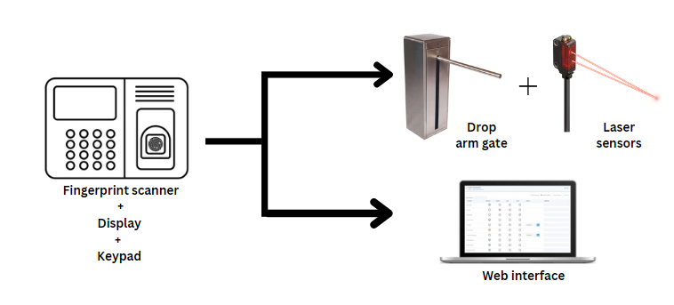
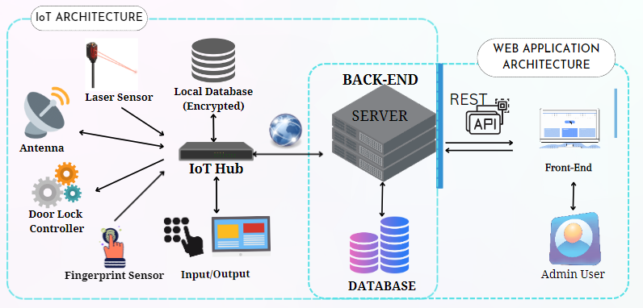

[comment]: # "This is the standard layout for the project, but you can clean this and use your own template"

# Smart Gatekeeping System & Authentication

---

## Team
-  E/18/068, Devinda G.C., [e18068@eng.pdn.ac.lk](mailto:e18068@eng.pdn.ac.lk)
-  E/18/330, Sewwandi H.R., [e18330@eng.pdn.ac.lk](mailto:e18330@eng.pdn.ac.lk)
-  E/18/368, Uduwange H.U., [e18368@eng.pdn.ac.lk](mailto:e18368@eng.pdn.ac.lk)

<!-- Image (photo/drawing of the final hardware) should be here -->

#### Table of Contents
1. [Introduction](#introduction)
2. [Solution Architecture](#solution-architecture )
3. [Hardware & Software Designs](#hardware-and-software-designs)
4. [Testing](#testing)"
5. [Detailed budget](#detailed-budget)
6. [Conclusion](#conclusion)
7. [Links](#links)

## Introduction
---

#### Motivation & Background

Based on the proper management and security purposes, authorities of various institutions use different methods like verifying the identity of a person and keeping records. The system they are using to achieve this may be different. As an example, in schools, after a student is getting registered at the school, they are assigned to a class and the teacher in charge of that class will get daily attendance by marking the register. An institution that is conducting tuition will register a student for a class by filling out a form and then, their attendance will mark by a person manually using a system at the entrance of the class. In private or government offices, they may have IDs to verify them as an employee of the office and they will sign a book or will use their IDs for marking their presence. These are the most common methods which are used for.

What we identified as problems here are as follows.
1. Although it is recorded as the person who attended there, cannot accurately know whether that person stays there or left.
2. The manual recording process costs time. If it’s a place where many people have to enter, then there will be a queue.
3. For tuition, it needs labor costs. So, an institution with large-scale tuition has to hire people and extra costs to them. 

Some systems have been introduced to give solutions for the above problems. Some websites are built up to keep records. But a person has to handle this manually. Fingerprint scanners are available now. The problem with that is if wanted, anyone can enter the place without scanning fingerprints. So unable to keep records of them. So, security is needed there to prevent someone from entering without keeping records.

So, the motivation of our project is to design a system that can verify the identity of a person/user who registered for the institution, keeping a record of their presence/attendance and confirm whether they entered after keeping the attendance record and also providing administration of relevant institution with manageable records. The system could be used for schools, tuition institutions, and offices. Students in schools, tuition, and employees in offices could use the system to enter the premises by keeping their attendance records.

#### Solution and the Impact

We propose to design a gatekeeping system that gets the attendance of the person using a fingerprint scanner(including a keypad and a display screen) and a drop arm gate that opens for a permitted fingerprint. The system is connected to a management system of the institution. The administration of the institution can view and handle data there.
The registered users can use the fingerprint scanner. In a situation where the fingerprint scanner cannot detect the fingerprint correctly, the user can use the keypad for entering permissions. The registration number will be the key to marking attendance. After scanning the fingerprint or giving the key, the display screen will display the relevant details of the user. Then, the gate will open for some time range and the user can pass through the gate. Before and after passing the gate, the laser sensors will detect whether the user passed the gate or not. So, with this process, the administration of the institution can see the record of the entrance of the user from the website. 
So, the system will provide a solution for the above problem by reducing the time spent on the process and by reducing the labor cost if it was needed there.

<!--  -->

## Solution Architecture
---
<!--  -->

## Hardware and Software Designs

Detailed designs with many sub-sections

## Testing

Testing done on hardware and software, detailed + summarized results

## Detailed budget

All items and costs

| Item          | Quantity  | Unit Cost  | Total  |
| ------------- |:---------:|:----------:|-------:|
| Sample item   | 5         | 10 LKR     | 50 LKR |

## Conclusion

What was achieved, future developments, commercialization plans

## Links

- [Project Repository](https://github.com/cepdnaclk/{{ page.repository-name }}){:target="_blank"}
- [Project Page](https://cepdnaclk.github.io/{{ page.repository-name}}){:target="_blank"}
- [Department of Computer Engineering](http://www.ce.pdn.ac.lk/)
- [University of Peradeniya](https://eng.pdn.ac.lk/)

[//]: # (Please refer this to learn more about Markdown syntax)
[//]: # (https://github.com/adam-p/markdown-here/wiki/Markdown-Cheatsheet)
